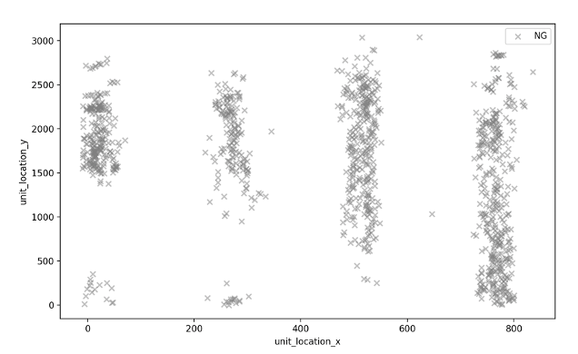

# nolan-brainrender

Repository for generating representations of different brain areas using brainrender. Generates 3D plots of structures in the whole mouse brain, or in a single hemisphere of the mouse brain. These plots can be manually manipulated to show any angle you need.

For more information on brainrender please see: https://elifesciences.org/articles/65751.

To view the source code for brainrender: https://github.com/brainglobe/brainrender

Probe and cluster annotations

Clusters are mapped to x,y probe space in um (Figure 1) in spike interface and probe interface as a result of spike sorting and exporting the spike report. The task we have is mapping this onto registered probe tracks and reconstruct cluster locations in the Allen brain common coordinate framework with the corresponding annotation.
 

Figure 1 – All clusters from Mouse M25 plotted in x y probe space
While spike interface expects a simple geometry, the probes might sit differently than a flat plane. Furthermore, registration to the Allen CCF means regions in the mouse brains will be compressed or expanded to accommodate the coordinates into the common framework. Therefore, we will calculate the empirically derived probe tracks by tracing the track with SHARP-Track and then extrapolating the probe tracks to the longest probe track in the brain, this is because we can expect the probe tracks to go beyond the cortex for the most medial probe if targeting to superficial MEC was accurate. To extract the x displacement from the probe (ML), we can look at the shank_id and calculate the deviation from some average x value (median even better). However, shank_id looks misclassified for some cells (Figure 2 left). We can correct the shank_id by partitioning the unit_location_x between clear probe locations 0-150 shank 0, 150-400 shank 1, 400-650 shank 2 and 650-800 shank 3 (Figure 2 right)
  
Figure 2 – shank_id versus unit_location_x, original (left) and corrected (right)
We can then take the projected probe tracks and plot the clusters using the tips of the probe as our frame of reference for mapping cluster locations accurately. This produces biologically plausible cluster locations as in the example below the probe track extruding outside of the brain doesn’t have clusters mapped to their locations. This is a great sanity check to see if these methods (cluster localisation in spike interface, and probe registration in SHARP-Track) are compatible.
  
Figure 3 – clusters plotted in brainrender, MEC in green
To generate the cluster annotations, we can use the border table generated with SHARP-Track or we can use the annotation volume to index each cluster voxel so it is consistent with the brain render image. The latter has the benefit of extrapolating the cluster annotations past the empirically derived probe tip. This is because we can assume some times go through the dura and leave patches of no found clusters (like above). Annotations derived from each method was similar, but the latter method generated less ‘out of brain [root]’ annotations.

